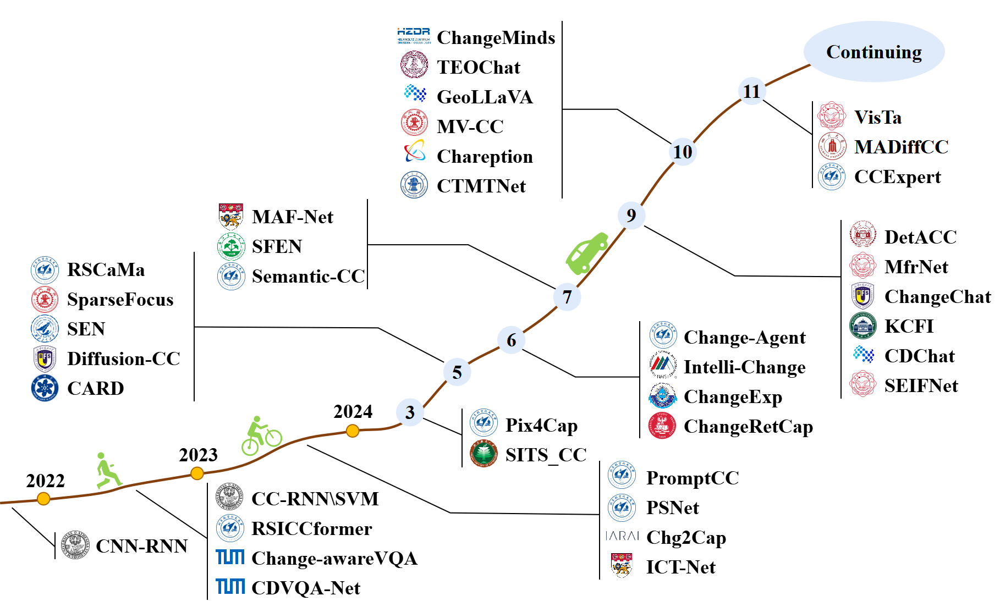

[](https://github.com/sindresorhus/awesome)
[](https://github.com/Chen-Yang-Liu/RS-Temporal-VLM/pulls)
<br />
<p align="center">
  <h1 align="center">Remote Sensing Temporal Vision-Language Models: A Comprehensive Survey</h1>
  <p align="center">
    <b> arXiv, 2024 </b>
    <br />
    <a href="https://chen-yang-liu.github.io/"><strong>Chenyang Liu </strong></a>
    ·
    <a href="https://levir.buaa.edu.cn/members/index.html"><strong> Jiafan Zhang </strong></a>
    ·
    <a href="https://chenkeyan.top/"><strong> Keyan Chen </strong></a>
    ·
    <a href="https://levir.buaa.edu.cn/members/index.html"><strong> Man Wang </strong></a>
    ·
    <a href="https://scholar.google.com/citations?user=DzwoyZsAAAAJ"><strong> Zhengxia Zou </strong></a>
    ·   
    <a href="https://scholar.google.com/citations?user=kNhFWQIAAAAJ"><strong> Zhenwei Shi </strong></a>
    
    
  </p>

  <p align="center">
    <a href='https://arxiv.org/'>
      
    </a>
<!--     <a href='https://ieeexplore.ieee.org/document/'>
      
    </a> -->
  </p>
<br />

This repo is used for recording, and tracking recent Remote Sensing Temporal Vision-Language Models (RS-TVLMs). If you find any work missing or have any suggestions (papers, implementations, and other resources), feel free to [pull requests](https://github.com/Chen-Yang-Liu/RS-Temporal-VLM/pulls).

### 🙌 Add Your Paper in our Repo and Survey!!!!!

- You are welcome to give us an issue or PR for your RS-TVLM work !!!!! We will record it for next version update of our survey


### 🥳 New

🔥🔥🔥 Updated on 2024.12.04 🔥🔥🔥

- **2024.12.04**: The first version is available.


### ✨ Highlight!!

-  The first survey for Remote Sensing Temporal Vision-Language models.

-  Some public datasets and code links are provided. 


## 📖 Introduction

Timeline of representative RS-TVLMs:



## 📖 Table of Contents
- [📚 Methods: A Survey](#methods-a-survey)
  - [Change Captioning](#change-captioning)
  - [Multitask Learning of Change Detection and Captioning](#Multitask-Learning-of-Change-Detection-and-Captioning)
  - [Change Visual Question Answering](#change-visual-question-answering)
  - [Text2Change Retrieval](#Text2Change-Retrieval)
  - [Change Grounding](#Change-Grounding)
  - [Large Language Models Meets Temporal Images](#Large-Language-Models-Meets-Temporal-Images)
  - ......
- [📊 Dataset](#Dataset)
  - [Matching Temporal Images and Text](#Matching-Temporal-Images-and-Text)
  - [Matching Temporal Images, Text, and Masks](#Matching-Temporal-Images,-Text,-and-Masks)
  - [Matching Temporal Images and Question-Answer Instructions](#Matching-Temporal-Images-and-Question-Answer-Instructions)
  - ......
- [👨‍🏫 Other Survey](#Other-Survey)
- [🖊️ Citation](#Citation)
- [🐲 Contact](#Contact)

## 📚 Methods: A Survey <a id="methods-a-survey"></a>
### Change Captioning
|   Model Name   | Paper Title                                                                                                                                                                              |    Visual Encoder     |         Language Decoder          |                    Code/Project                    |
|:--------------:|------------------------------------------------------------------------------------------------------------------------------------------------------------------------------------------|:---------------------:|:---------------------------------:|:--------------------------------------------------:|
|    CNN-RNN     | [Captioning changes in bi-temporal remote sensing images](https://ieeexplore.ieee.org/abstract/document/9554419)                                                                         |        VGG-16         |                RNN                |                        N/A                         |
|   CC-RNN/SVM   | [Change captioning: A new paradigm for multitemporal remote sensing image analysis](https://ieeexplore.ieee.org/abstract/document/9847254)                                               |        VGG-16         |              RNN,SVM              |                        N/A                         |
|  RSICCformer   | [Remote sensing image change captioning with dual-branch transformers: A new method and a large scale dataset](https://ieeexplore.ieee.org/document/9934924)                             |      ResNet-101       |        Transformer Decoder        |   [code](https://github.com/Chen-Yang-Liu/RSICC)   |
|     PSNet      | [Progressive Scale-aware Network for Remote sensing Image Change Captioning](https://ieeexplore.ieee.org/abstract/document/10283451)                                                     |       ViT-B/32        |        Transformer Decoder        |   [code](https://github.com/Chen-Yang-Liu/PSNet)   |
|    PromptCC    | [A Decoupling Paradigm with Prompt Learning for Remote Sensing Image Change Captioning](https://ieeexplore.ieee.org/document/10271701)                                                   |       ViT-B/32        |               GPT-2               | [code](https://github.com/Chen-Yang-Liu/PromptCC)  |
|    Chg2Cap     | [Changes to Captions: An Attentive Network for Remote Sensing Change Captioning](https://ieeexplore.ieee.org/abstract/document/10305516)                                                 |      ResNet-101       |        Transformer Decoder        |  [code](https://github.com/ShizhenChang/Chg2Cap)   |
|    ICT-Net     | [Interactive Change-Aware Transformer Network for Remote Sensing Image Change Captioning](https://www.mdpi.com/2072-4292/15/23/5611)                                                     |      ResNet-101       |        Transformer Decoder        |     [code](https://github.com/caicch/ICT-Net)      |
|    SITS-CC     | [Change Caption for Satellite Images Time Series](https://ieeexplore.ieee.org/abstract/document/10485459)                                                                                |      ResNet-101       |        Transformer Decoder        |    [code](https://github.com/Crueyl123/SITSCC)     |
|     RSCaMa     | [RSCaMa: Remote Sensing Image Change Captioning with State Space Model](https://ieeexplore.ieee.org/document/10537177)                                                                   |       ViT-B/32        | Mamba, Transformer Decoder, GPT-2 |  [code](https://github.com/Chen-Yang-Liu/RSCaMa)   |
|  SparseFocus   | [A Lightweight Sparse Focus Transformer for Remote Sensing Image Change Captioning](https://arxiv.org/abs/2405.06598)                                                                    |      ResNet-101       |        Transformer Decoder        | [code](https://github.com/sundongwei/SFT_chag2cap) |
|      SEN       | [Single-stream Extractor Network with Contrastive Pre-training for Remote Sensing Change Captioning](https://ieeexplore.ieee.org/abstract/document/10530145)                             | ResNet with 6-channel |        Transformer Decoder        |       [code](https://github.com/mrazhou/SEN)       |
| Diffusion-RSCC | [Diffusion model for learning cross-modal data distribution](https://arxiv.org/abs/2405.12875)                                                                                           |      ResNet-101       |             Diffusion             |  [code](https://github.com/Fay-Y/Diffusion-RSCC)   |
|      CARD      | [Context-aware Difference Distilling for Multi-change Captioning](https://arxiv.org/abs/2405.20810)                                                                                      |      ResNet-101       |        Transformer Decoder        |      [code](https://github.com/tuyunbin/CARD)      |
|  ChangeRetCap  | [Towards a multimodal framework for remote sensing image change retrieval and captioning](https://arxiv.org/abs/2406.13424)                                                              |      ResNet-101       |        Transformer Decoder        |   [code](https://github.com/rogerferrod/RSICRC)    |
| Intelli-Change | [Intelli-Change Remote Sensing - A Novel Transformer Approach](https://ieeexplore.ieee.org/document/10594026)                                                                            |      ResNet-101       |        Transformer Decoder        |                        N/A                         |
|   ChangeExp    | [Towards Temporal Change Explanations from Bi-Temporal Satellite Images](https://arxiv.org/abs/2407.09548)                                                                               |       LLaVA-1.5       |             LLaVA-1.5             |                        N/A                         |
|    MAF-Net     | [Multi-scale Attentive Fusion Network for Remote Sensing Image Change Captioning](https://ieeexplore.ieee.org/document/10558583)                                                         |      ResNet-101       |        Transformer Decoder        |                        N/A                         |
|      SFEN      | [Scale-wised feature enhancement network for change captioning of remote sensing images](https://www.tandfonline.com/doi/abs/10.1080/01431161.2024.2380544)                              |      WideResNet       |        Transformer Decoder        |                        N/A                         |
|     MfrNet     | [MfrNet: A New Multi-Scale Feature Refining Method for Remote Sensing Image Change Captioning](https://ieeexplore.ieee.org/document/10640584)                                            |       ResNet-18       |        Transformer Decoder        |                        N/A                         |
|    SEIFNet     | [Inter-Temporal Interaction and Symmetric Difference Learning for Remote Sensing Image Change Captioning](https://ieeexplore.ieee.org/abstract/document/10689474)                        |      ResNet-101       |        Transformer Decoder        |   [code](https://github.com/romanticLYP/TISDNet)   |
|     MV-CC      | [MV-CC: Mask Enhanced Video Model for Remote Sensing Change Caption](https://arxiv.org/abs/2410.23946)                                                                                   |     InternVideo2      |        Transformer Decoder        |     [code](https://github.com/liuruixun/MV-CC)     |
| Chareption     | [Chareption: Change-Aware Adaption Empowers Large Language Model for Effective Remote Sensing Image Change Captioning](https://link.springer.com/chapter/10.1007/978-981-97-8493-6_24)   | CLIP ViT-L/14           | LLaMA-7B                                | N/A          |
|    MADiffCC    | [Remote Sensing Image Change Captioning Using Multi-Attentive Network with Diffusion Model](https://www.mdpi.com/2072-4292/16/21/4083)                                                   |    Diffusion          |        Transformer Decoder        |                        N/A                         |  
|    CCExpert    | [CCExpert: Advancing MLLM Capability in Remote Sensing Change Captioning with Difference-Aware Integration and a Foundational Dataset](https://arxiv.org/abs/2411.11360)                 |    Diffusion          |        Transformer Decoder        |   [code](https://github.com/Meize0729/CCExpert)    | 
|     ......     

### Multitask Learning of Change Detection and Captioning
|  Model Name  | Paper Title                                                                                                                                                                        |   Visual Encoder    |   Language Decoder   |                     Code/Project                      |
|:------------:|------------------------------------------------------------------------------------------------------------------------------------------------------------------------------------|:-------------------:|:--------------------:|:-----------------------------------------------------:|
| Pix4Cap      | [Pixel-Level Change Detection Pseudo-Label Learning for Remote Sensing Change Captioning](https://arxiv.org/abs/2312.15311)                                                        |      ViT-B/32       | Transformer Decoder  | [code](https://github.com/Chen-Yang-Liu/Change-Agent) |
| Change-Agent | [Change-Agent: Toward Interactive Comprehensive Remote Sensing Change Interpretation and Analysis](https://ieeexplore.ieee.org/abstract/document/10591792)                         |      ViT-B/32       | Transformer Decoder  |                          [code](https://github.com/Chen-Yang-Liu/Change-Agent)                         |
| Semantic-CC  | [Semantic-CC: Boosting Remote Sensing Image Change Captioning via Foundational Knowledge and Semantic Guidance](https://arxiv.org/abs/2407.14032)                                  |         SAM         |        Vicuna        |                          N/A                          |
|    DetACC    | [Detection Assisted Change Captioning for Remote Sensing Image](https://ieeexplore.ieee.org/document/10640971)                                                                     |     ResNet-101      | Transformer Decoder  |                          N/A                          |
|     KCFI     | [Enhancing Perception of Key Changes in Remote Sensing Image Change Captioning](https://arxiv.org/abs/2409.12612)                                                                  |         ViT         |         Qwen         |      [code](https://github.com/yangcong356/KCFI)      |
| ChangeMinds  | [ChangeMinds: Multi-task Framework for Detecting and Describing Changes in Remote Sensing](https://arxiv.org/abs/2410.10047)                                                       | Swin Transformer    | Transformer Decoder |  [code](https://github.com/Y-D-Wang/ChangeMinds)      |
|   CTMTNet    | [A Multi-Task Network and Two Large Scale Datasets for Change Detection and Captioning in Remote Sensing Images](https://ieeexplore.ieee.org/document/10740028)                    |     ResNet-101      | Transformer Decoder  |                          N/A                          |
| ......

### Change Visual Question Answering
|    Model Name     | Paper Title                                                                                                                                      |   Visual Encoder   |       Language Decoder        |                  Code/Project                  |
|:-----------------:|--------------------------------------------------------------------------------------------------------------------------------------------------|:------------------:|:-----------------------------:|:----------------------------------------------:|
| change-aware VQA  | [Change-Aware Visual Question Answering](https://ieeexplore.ieee.org/document/9884801)                                                           |        CNN         |              RNN              |                      N/A                       |
|     CDVQA-Net     | [Change Detection Meets Visual Question Answering](https://ieeexplore.ieee.org/document/9901476)                                                 |        CNN         |              RNN              |  [code](https://github.com/YZHJessica/CDVQA)   |
|    ChangeChat     | [ChangeChat: An Interactive Model for Remote Sensing Change Analysis via Multimodal Instruction Tuning](https://arxiv.org/abs/2409.08582)        |      CLIP-ViT      |          Vicuna-v1.5          | [code](https://github.com/hanlinwu/ChangeChat) |
|      CDchat       | [CDChat: A Large Multimodal Model for Remote Sensing Change Description](https://arxiv.org/abs/2409.16261)                                       |   CLIP ViT-L/14    |          Vicuna-v1.5          |    [code](https://github.com/techmn/cdchat)    |
|      TEOChat      | [TEOChat: A Large Vision-Language Assistant for Temporal Earth Observation Data](https://arxiv.org/abs/2410.06234)                               |   CLIP ViT-L/14    |            LLaMA-2            | [code](https://github.com/ermongroup/TEOChat)  |
|     GeoLLaVA      | [GeoLLaVA: Efficient Fine-Tuned Vision-Language Models for Temporal Change Detection in Remote Sensing](https://arxiv.org/abs/2410.19552)        |   Video encoder    |  LLaVA-NeXT and Video-LLaVA   |  [code](https://github.com/HosamGen/GeoLLaVA)  |
|       CDQAG       | [Show Me What and Where has Changed?  Question Answering and Grounding for Remote Sensing Change Detection](https://arxiv.org/abs/2410.23828)    | CLIP image Encoder |       CLIP Text Encoder       |    [code](https://github.com/like413/VisTA)    |
| ......

### Text2Change Retrieval
|    Model Name     | Paper Title                                                                                                                                                 |                  Code/Project                  |
|:-----------------:|-------------------------------------------------------------------------------------------------------------------------------------------------------------|:----------------------------------------------:|
|  ChangeRetCap  | [Towards a multimodal framework for remote sensing image change retrieval and captioning](https://arxiv.org/abs/2406.13424)                                 | [code](https://github.com/rogerferrod/RSICRC)  |
| ......


### Change Grounding
|    Model Name     | Paper Title                                                                                                                                   |                  Code/Project                  |
|:-----------------:|-----------------------------------------------------------------------------------------------------------------------------------------------|:----------------------------------------------:|
|    ChangeChat     | [ChangeChat: An Interactive Model for Remote Sensing Change Analysis via Multimodal Instruction Tuning](https://arxiv.org/abs/2409.08582)     | [code](https://github.com/hanlinwu/ChangeChat) |
|      CDchat       | [CDChat: A Large Multimodal Model for Remote Sensing Change Description](https://arxiv.org/abs/2409.16261)                                    |    [code](https://github.com/techmn/cdchat)    |
|      TEOChat      | [TEOChat: A Large Vision-Language Assistant for Temporal Earth Observation Data](https://arxiv.org/abs/2410.06234)                            | [code](https://github.com/ermongroup/TEOChat)  |
|       CDQAG       | [Show Me What and Where has Changed?  Question Answering and Grounding for Remote Sensing Change Detection](https://arxiv.org/abs/2410.23828) |    [code](https://github.com/like413/VisTA)    |
| ......


### Large Language Models Meets Temporal Images

|    Method    | Release Time |     LLM     |   Fine-tuning   |   Task   | Paper Title | Code/Project                                          |
|:------------:|:------------:|:-----------:|:---------------:|:--------:|-------------|:------------------------------------------------------:|
|   PromptCC   | 2023.06      |    GPT-2    | Prompt Learning |    CC    | [A Decoupling Paradigm with Prompt Learning for Remote Sensing Image Change Captioning](https://ieeexplore.ieee.org/document/10271701) | [code](https://github.com/Chen-Yang-Liu/PromptCC)     |
| Change-Agent | 2024.07      |  Chatgpt    |       --        |  CC, CD  | [Change-Agent: Toward Interactive Comprehensive Remote Sensing Change Interpretation and Analysis](https://ieeexplore.ieee.org/abstract/document/10591792)  | [code](https://github.com/Chen-Yang-Liu/Change-Agent) |
| Semantic-CC  | 2024.07      |   Vicuna    |      LoRA       |    CC    |[Semantic-CC: Boosting Remote Sensing Image Change Captioning via Foundational Knowledge and Semantic Guidance](https://arxiv.org/abs/2407.14032)  |
|  ChangeChat  | 2024.09      | Vicuna-v1.5 |      LoRA       | CVQA, CG |[ChangeChat: An Interactive Model for Remote Sensing Change Analysis via Multimodal Instruction Tuning](https://arxiv.org/abs/2409.08582) | [code](https://github.com/hanlinwu/ChangeChat)        |
|     KCFI     | 2024.09      |    Qwen     |     Prompt      |    CC    |[Enhancing Perception of Key Changes in Remote Sensing Image Change Captioning](https://arxiv.org/abs/2409.12612)   | [code](https://github.com/yangcong356/KCFI)           |
|    CDChat    | 2024.09      | Vicuna-v1.5 |      LoRA       |   CVQA   |[CDChat: A Large Multimodal Model for Remote Sensing Change Description](https://arxiv.org/abs/2409.16261)  | [code](https://github.com/techmn/cdchat)              |
|   TEOChat    | 2024.10      |   LLaMA-2   |      LoRA       | CVQA, CG |[TEOChat: A Large Vision-Language Assistant for Temporal Earth Observation Data](https://arxiv.org/abs/2410.06234)   | [code](https://github.com/ermongroup/TEOChat)         |
|   GeoLLaVA   | 2024.10      | LLaVA-NeXT  |      LoRA       |   CVQA   |[GeoLLaVA: Efficient Fine-Tuned Vision-Language Models for Temporal Change Detection in Remote Sensing](https://arxiv.org/abs/2410.19552) | [code](https://github.com/HosamGen/GeoLLaVA)          |
|  Chareption  | 2024.10      |  LLaMA-7B   |     Adapter     |    CC    |[Chareption: Change-Aware Adaption Empowers Large Language Model for Effective Remote Sensing Image Change Captioning](https://link.springer.com/chapter/10.1007/978-981-97-8493-6_24) |
|   CCExpert   | 2024.11      |   Qwen-2    |      LoRA       |    CC    |[CCExpert: Advancing MLLM Capability in Remote Sensing Change Captioning with Difference-Aware Integration and a Foundational Dataset](https://arxiv.org/abs/2411.11360)  | [code](https://github.com/Meize0729/CCExpert)         |
|    ......    

 

## 📊 Dataset <a id="Dataset"></a>

- **Dataset Matching Temporal Images and Text:**

|  Dataset  | Image Size/Resolution | Image pairs | Captions | Annotation |                       Download Link                       |
|:---------:|:---------------------:|:-----------:|:--------:|:----------:|:---------------------------------------------------------:|
| DUBAI CCD |      50×50 (30m)      |     500     |  2,500   |   Manual   |   [Link](https://disi.unitn.it/~melgani/datasets.html)    |
| LEVIR CCD |    256×256 (0.5m)     |     500     |  2,500   |   Manual   |   [Link](https://disi.unitn.it/~melgani/datasets.html)    |
| LEVIR-CC  |    256×256 (0.5m)     |   10,077    |  50,385  |   Manual   | [Link](https://github.com/Chen-Yang-Liu/LEVIR-CC-Dataset) |
|  WHU-CDC  |   256×256 (0.075m)    |    7,434    |  37,170  |   Manual   | [Link](https://huggingface.co/datasets/hygge10111/RS-CDC) |


- **Dataset Matching Temporal Images, Text, and Masks:** 

|  Dataset  | Image Size/Resolution | Image pairs | Captions |    Pixel-level Masks    | Annotation |                       Download Link                       |
|:---------:|:-------------------:|:-------------:|:---------:|:-----------------------:|:------------:|:---------------------------------------------------------:|
| LEVIR-MCI | 256×256 (0.5m)        | 10,077      | 50,385   | 44,380 (building, road) | Manual     | [Link](https://huggingface.co/datasets/lcybuaa/LEVIR-MCI) |
| LEVIR-CDC | 256×256 (0.5m)        | 10,077      | 50,385   |      -- (building)      | Manual     | [Link](https://huggingface.co/datasets/hygge10111/RS-CDC) |
|  WHU-CDC  | 256×256 (0.075m)      | 7,434       | 37,170   |      -- (building)      | Manual     | [Link](https://huggingface.co/datasets/hygge10111/RS-CDC) |


- **Dataset Matching Temporal Images and Question-Answer Instructions:** 

|    Dataset     |        Temporal Images        | Image Resolution | Instruction Samples |       Change-related Task       | Annotation |                 Download Link                  |
|:--------------:|:-----------------------------:|:----------------:|:-------------------:|:-------------------------------:|:----------:|:----------------------------------------------:|
|     CDVQA      |   2,968 pairs (bi-temporal)   |     0.5m~3m      |       122,000       |              CVQA               |   Manual   |  [Link](https://github.com/YZHJessica/CDVQA)   |
| ChangeChat-87k |  10,077 pairs (bi-temporal)   |       0.5m       |       87,195        |         CVQA, Grounding         | Automated  | [Link](https://github.com/hanlinwu/ChangeChat) |
|    GeoLLaVA    |  100,000 pairs (bi-temporal)  |        --        |       100,000       |              CVQA               | Automated  |  [Link](https://github.com/HosamGen/GeoLLaVA)  |
|   TEOChatlas   | -- (variable temporal length) |        --        |       554,071       | Classification, CVQA, Grounding | Automated  | [Link](https://github.com/ermongroup/TEOChat)  |
|    QVG-360K    |   6,810 pairs (bi-temporal)   |     0.1m~3m      |       360,000       |         CVQA, Grounding         | Automated  |    [Link](https://github.com/like413/VisTA)    |

### ......


### 👨‍🏫 Other Survey <a id="Other-Survey"></a>

| Year  | Paper Title                                                                                                                                                                       |
|:-----:|-----------------------------------------------------------------------------------------------------------------------------------------------------------------------------------|
| 2023  | [An Agenda for Multimodal Foundation Models for Earth Observation](https://ieeexplore.ieee.org/abstract/document/10282966)                                                        |
| 2023  | [Self-Supervised Remote Sensing Feature Learning: Learning Paradigms, Challenges, and Future Works](https://ieeexplore.ieee.org/abstract/document/10126079)                       |
| 2023  | [Large Remote Sensing Model: Progress and Prospects](http://ch.whu.edu.cn/cn/article/doi/10.13203/j.whugis20230341)                                                               |
| 2023  | [Brain-Inspired Remote Sensing Foundation Models and Open Problems: A Comprehensive Survey](https://ieeexplore.ieee.org/abstract/document/10254282)                               |
| 2023  | [On the Promises and Challenges of Multimodal Foundation Models for Geographical, Environmental, Agricultural, and Urban Planning Applications](https://arxiv.org/abs/2312.17016) |
| 2024  | [Vision-Language Models in Remote Sensing: Current Progress and Future Trends](https://arxiv.org/abs/2305.05726)                                                                  |
| 2024  | [On the Foundations of Earth and Climate Foundation Models](https://arxiv.org/abs/2405.04285)                                                                                     |
| 2024  | [Towards Vision-Language Geo-Foundation Model: A Survey](http://arxiv.org/abs/2406.09385)                                                                                         | 
| 2024  | [Language Integration in Remote Sensing: Tasks, datasets, and future directions](https://ieeexplore.ieee.org/document/10278197/?arnumber=10278197)                                |
| 2024  | [Advancements in Visual Language Models for Remote Sensing: Datasets, Capabilities, and Enhancement Techniques](http://arxiv.org/abs/2410.17283)                                  |
| 2024  | [An LLM Agent for Automatic Geospatial Data Analysis](http://arxiv.org/abs/2410.18792)                                                                                 |
| 2024  | [COREval: A Comprehensive and Objective Benchmark for Evaluating the Remote Sensing Capabilities of Large Vision-Language Models](http://arxiv.org/abs/2411.18145)|


## 🖊️ Citation <a id="Citation"></a>

If you find our survey and repository useful for your research, please consider citing our paper:

```bibtex
@article{liu2024remote,
  title={Remote Sensing Temporal Vision-Language Models: A Comprehensive Survey},
```

## 🐲 Contact <a id="Contact"></a>

```
liuchenyang@buaa.edu.cn
```

